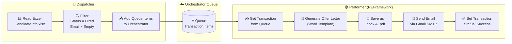
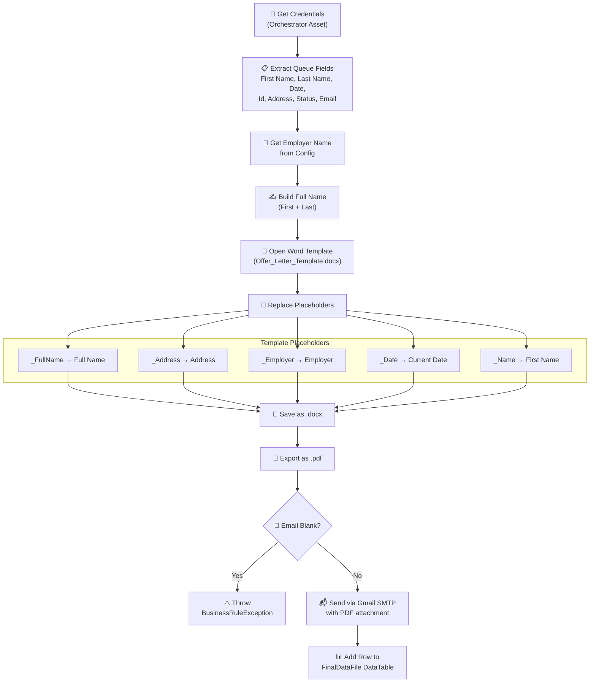
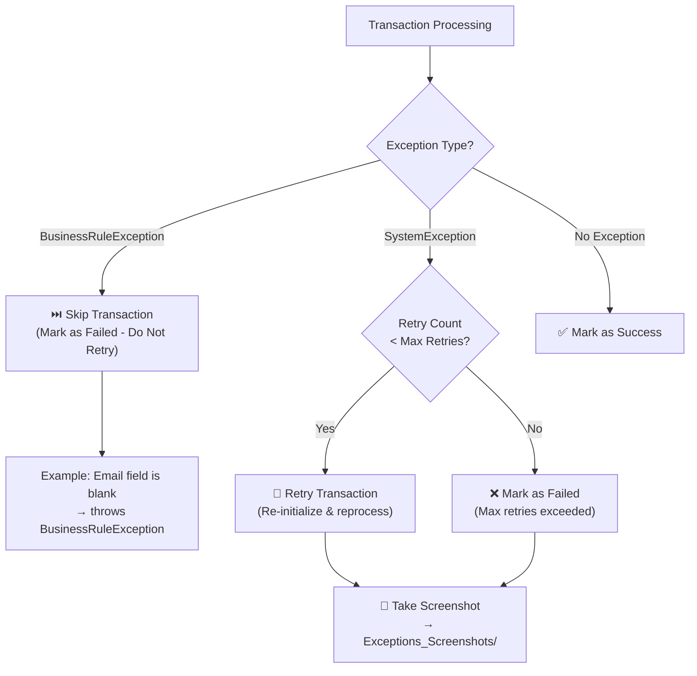
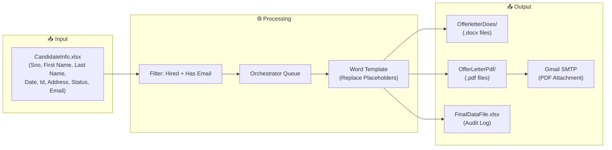

# 📄 REF_HR_OfferLetter_Generater

> **Enterprise-grade UiPath RPA automation** that reads candidate data, generates personalized offer letters from a Word template, and emails them as PDF attachments — all built on the **Robotic Enterprise Framework (REFramework)** with a **Dispatcher-Performer** architecture.

---

## 📝 Project Overview

**REF_HR_OfferLetter_Generater** automates the end-to-end HR onboarding workflow for delivering offer letters to successfully hired candidates. It follows the industry-standard **Dispatcher-Performer** design pattern on top of UiPath's **REFramework** state machine, providing production-grade reliability through built-in retry logic, exception handling, and Orchestrator queue-based transaction management.

| Detail | Value |
|---|---|
| **Platform** | UiPath Studio `26.0.188.0` |
| **Framework** | REFramework (State Machine) |
| **Target** | Windows |
| **Language** | VisualBasic Expressions |
| **Version** | `1.0.0` |
| **License** | MIT |

---

## 🏗️ Architecture

### High-Level Dispatcher-Performer Flow



### REFramework State Machine (Performer – `Main.xaml`)

```mermaid
stateDiagram-v2
    [*] --> Init
    Init --> GetTransactionData : Success
    Init --> End : SystemException / No Config

    GetTransactionData --> Process : New Transaction
    GetTransactionData --> End : No More Transactions

    Process --> GetTransactionData : Success
    Process --> GetTransactionData : BusinessRuleException (Skip)
    Process --> Init : SystemException (Retry / Re-Init)

    End --> [*]

    state Init {
        direction LR
        s1: Load Config.xlsx
        s2: Initialize Settings & Assets
        s3: Get Gmail Credentials
        s1 --> s2 --> s3
    }

    state Process {
        direction LR
        p1: Extract Queue Data
        p2: Replace Word Placeholders
        p3: Save .docx & .pdf
        p4: Send SMTP Email
        p5: Log to DataTable
        p1 --> p2 --> p3 --> p4 --> p5
    }
```

---

## ⚙️ How It Works

### 1. Dispatcher (`Offer_Letter_Dispatcher.xaml`)

The Dispatcher is a standalone workflow invoked from within `Main.xaml`'s **Init** state. It reads raw candidate data, filters it, and populates the Orchestrator Queue.

| Step | Action | Detail |
|---|---|---|
| 1 | **Read Excel** | Reads `CandidateInfo.xlsx` using the sheet name from `Config.xlsx` |
| 2 | **Filter Data** | Keeps only rows where `Status = "Hired"` **AND** `Email` is not empty |
| 3 | **Add Queue Items** | Iterates filtered rows and pushes each as a Queue Item with fields: `First Name`, `Last Name`, `Date`, `Id`, `Address`, `Status`, `Email` |
| 4 | **Reference** | Each item's `Reference` is set to the candidate's `Sno` for traceability |

### 2. Performer (`Main.xaml` → `Framework/Process.xaml`)

The Performer is the REFramework state machine that processes each queue transaction:



### Key Processing Details

- **Word Application Scope** opens the template, performs five `Replace Text` operations, then saves both `.docx` and `.pdf` copies.
- **Output directories** are auto-created if they don't exist (`Folder Exists` check + `Create Folder`).
- **Gmail SMTP** sends the PDF as an attachment. Credentials are fetched from an **Orchestrator Credential Asset**.
- **Data tracking**: Each successful transaction is logged to a `DataTable` (columns: `First Name`, `Last Name`, `Date`, `Id`, `Address`, `Status`, `Email`, `CurrentDate`, `NowStatus`) and written to `FinalDataFile.xlsx`.

---

## 📁 Project Structure

```
REF_HR_OfferLetter_Generater/
│
├── Main.xaml                          # REFramework state machine (Performer entry point)
├── Offer_Letter_Dispatcher.xaml       # Dispatcher: reads Excel → populates Queue
├── project.json                       # UiPath project config & dependencies
├── entry-points.json                  # Orchestrator entry point definitions
├── LICENSE                            # MIT License
│
├── Framework/                         # REFramework workflow components
│   ├── InitAllSettings.xaml           #   Load Config.xlsx & initialize settings
│   ├── InitAllApplications.xaml       #   Open/initialize required applications
│   ├── GetTransactionData.xaml        #   Fetch next Queue Item from Orchestrator
│   ├── Process.xaml                   #   Core business logic (generate & email)
│   ├── SetTransactionStatus.xaml      #   Mark transaction Success/Failed/Retry
│   ├── RetryCurrentTransaction.xaml   #   Retry logic for system exceptions
│   ├── CloseAllApplications.xaml      #   Graceful app closure
│   ├── KillAllProcesses.xaml          #   Force-kill apps on fatal errors
│   └── TakeScreenshot.xaml            #   Capture screenshot on exceptions
│
├── Data/
│   ├── Config.xlsx                    # All settings, constants & asset names
│   ├── CandidateInfo.xlsx             # Source candidate data
│   ├── Offer_Letter_Template.docx     # Word template with placeholders
│   ├── Input/
│   │   └── CandidateInfo.xlsx         # Input copy of candidate data
│   ├── Output/
│   │   ├── OfferletterDoes/           # Generated .docx offer letters
│   │   ├── OfferLetterPdf/            # Generated .pdf offer letters
│   │   └── FinalDataFile.xlsx         # Transaction results/audit log
│   └── Temp/                          # Temporary processing files
│
├── Exceptions_Screenshots/            # Auto-captured screenshots on errors
│
├── Tests/                             # UiPath test cases
│   ├── MainTestCase.xaml
│   ├── ProcessTestCase.xaml
│   ├── GetTransactionDataTestCase.xaml
│   ├── InitAllSettingsTestCase.xaml
│   ├── InitAllApplicationsTestCase.xaml
│   ├── WorkflowTestCaseTemplate.xaml
│   └── Tests.xlsx
│
└── Documentation/
    └── REFramework Documentation-EN.pdf
```

---

## 🛠️ Technology Stack & Dependencies

| Package | Version | Purpose |
|---|---|---|
| `UiPath.System.Activities` | `26.2.0` | Core system activities & file operations |
| `UiPath.Excel.Activities` | `3.4.1` | Read/Write Excel workbooks |
| `UiPath.Word.Activities` | `2.4.1` | Word template manipulation (Replace Text, Save As, Export to PDF) |
| `UiPath.Mail.Activities` | `2.7.10` | Gmail SMTP email sending with attachments |
| `UiPath.UIAutomation.Activities` | `26.1.0-preview` | UI Automation capabilities |
| `UiPath.Testing.Activities` | `25.10.1` | Unit test framework for workflow validation |

---

## 🚀 Setup & Configuration

### Prerequisites

- **UiPath Studio** `26.x` or later (Windows target)
- **UiPath Orchestrator** access with a configured Queue and Credential Asset
- **Microsoft Word** installed (for Word Application Scope)
- **Gmail Account** with App Password or OAuth configured for SMTP

### Step-by-Step

1. **Clone the repository**
   ```bash
   git clone https://github.com/<your-username>/REF_HR_OfferLetter_Generater.git
   ```

2. **Open in UiPath Studio** → Open `project.json`

3. **Configure `Data/Config.xlsx`** with your environment-specific values:

   | Setting Key | Description | Example |
   |---|---|---|
   | `FirstFilePath` | Path to input Excel with candidate data | `Data\Input\CandidateInfo.xlsx` |
   | `Sheet1` | Sheet name in the candidate Excel file | `Sheet1` |
   | `TemplateFilePath` | Path to the Word offer letter template | `Data\Offer_Letter_Template.docx` |
   | `OfferLetterFolderPathDOSE` | Output directory for `.docx` files | `Data\Output\OfferletterDoes` |
   | `OfferLetterFolderPathPdf` | Output directory for `.pdf` files | `Data\Output\OfferLetterPdf` |
   | `OrchestratorQueueName` | Name of the Orchestrator Queue | `HR_OfferLetter_Queue` |
   | `OrchestratorQueueFolder` | Orchestrator folder path | `Default` |
   | `Sender_Gmail` | Orchestrator Credential Asset name for Gmail | `Gmail_Credentials` |
   | `EmployerName` | Company/employer name for the letter | `Acme Corp` |
   | `EmailSubject` | Subject line for the offer email | `Your Offer Letter` |
   | `EmailBody` | Body text for the offer email | `Please find attached...` |
   | `Gmail_SMTP_Server` | SMTP server address | `smtp.gmail.com` |
   | `Gmail_SMTP_Port` | SMTP port number | `587` |
   | `Reciver` | Default recipient (override per candidate) | `hr@company.com` |

4. **Set up Orchestrator**
   - Create a Queue matching `OrchestratorQueueName`
   - Create a Credential Asset matching `Sender_Gmail` with your Gmail username and App Password

5. **Run the Dispatcher** → Execute `Offer_Letter_Dispatcher.xaml` to read candidates and populate the queue

6. **Run the Performer** → Execute `Main.xaml` to process each transaction, generate letters, and send emails

---

## 🛡️ Exception Handling



| Exception Type | Behavior | Example |
|---|---|---|
| **BusinessRuleException** | Transaction is skipped (no retry). Logged as a business failure. | Candidate email is blank or invalid |
| **System Exception** | Transaction is retried up to the configured limit. Screenshots are captured automatically. | Word application crash, SMTP timeout, network failure |
| **Success** | Transaction marked complete. Row added to `FinalDataFile.xlsx` with status `"Success"`. | Letter generated and emailed successfully |

---

## 🧪 Testing

The project includes **6 UiPath test case workflows** in the `Tests/` directory:

| Test Case | What It Validates |
|---|---|
| `MainTestCase.xaml` | End-to-end execution of the main state machine |
| `ProcessTestCase.xaml` | Core business logic (template generation + email) |
| `GetTransactionDataTestCase.xaml` | Queue item retrieval from Orchestrator |
| `InitAllSettingsTestCase.xaml` | Config.xlsx loading and settings initialization |
| `InitAllApplicationsTestCase.xaml` | Application initialization workflows |
| `WorkflowTestCaseTemplate.xaml` | Reusable test case template |

Run tests from **UiPath Studio** → Test Explorer, or via **UiPath Test Manager**.

---

## 📊 Data Flow Summary



---

## 📜 License

This project is licensed under the **MIT License** — see the [LICENSE](LICENSE) file for details.
